# 🏠 HOME — CompuCom PAT Knowledge Base

---

> Welcome to the **Product Assistance Team (PAT)** documentation vault. This is your central hub for navigating all systems, processes, and references used daily at CompuCom.

---

## How This Vault Works

This knowledge base is built in **Obsidian** — a tool that connects notes through internal links. Every term, process, and system is interconnected. You can click any `[[link]]` to jump directly to the related note.

The vault is organized by **system** — each module covers one platform and includes its related processes underneath. Think of it as a map:

```mermaid
flowchart TD
    HOME["🏠 HOME"]

    HOME --> DIMS["⚙️ 01-DIMS\n(Central Backend)"]
    HOME --> SF["💼 02-Salesforce\n(CRM Platform)"]
    HOME --> MKP["🛒 03-Marketplace\n(Storefront)"]
    HOME --> PAT["🔧 04-PAT\n(CPT Tool)"]

    DIMS --> D1["Overview"]
    DIMS --> D2["Installation"]
    DIMS --> D3["Commands"]
    DIMS --> D4["Order Types"]
    DIMS --> D5["📋 Electronic Hold\n(Connect Portal)"]
    DIMS --> D6["📋 Kill User\n(Connect Portal)"]
    DIMS --> D7["📋 Change Order Status\n(DIMS)"]
    DIMS --> D8["📋 Account Profile\n(One Touch)"]

    SF --> S1["Overview"]
    SF --> S2["Initial Setup"]
    SF --> S3["📋 Change Owner Queue\n(Salesforce)"]
    SF --> S4["📋 Change Multiple Owner\n(Salesforce)"]
    SF --> S5["📋 B2B User Group\n(Salesforce)"]
    SF --> S6["📋 User Rights\n(Salesforce)"]
    SF --> S7["📋 Remove User\n(Salesforce)"]

    MKP --> M1["Overview"]
    MKP --> M2["📋 SAML Authentication\n(Connect Portal)"]

    PAT --> P1["Overview"]
    PAT --> P2["📋 Create Price Rule\n(CPT)"]
    PAT --> P3["📋 Remove SKU\n(CPT)"]
    PAT --> P4["📋 Update SKUs\n(CPT)"]

    HOME --> REF["📚 Reference"]
    REF --> R1["📖 Glossary"]
    REF --> R2["👥 Contacts"]
    REF --> R3["🔐 Access Requests"]
    REF --> R4["⚡ Cheatsheet"]

    style HOME fill:#1a1a2e,color:#fff,stroke:#e94560
    style DIMS fill:#0f3460,color:#fff,stroke:#16213e
    style SF fill:#533483,color:#fff,stroke:#16213e
    style MKP fill:#e94560,color:#fff,stroke:#16213e
    style PAT fill:#00b4d8,color:#fff,stroke:#16213e
    style REF fill:#2d3436,color:#fff,stroke:#636e72
```

---

## 🗂️ System Modules

### 1. DIMS — Central Backend System

The core of all CompuCom operations. Every order lives here.

| Note | What you'll find |
|---|---|
| [[⚙️ DIMS - Overview]] | What DIMS is, environments (Production vs UAT), Service Order types, priority levels |
| [[⚙️ DIMS - Installation]] | How to install sNetTerm from Company Portal and configure SSH access |
| [[⚙️ DIMS - Commands]] | All ESS commands, keyboard shortcuts, action commands |
| [[⚙️ DIMS - Order Types]] | Complete order classification: source (A/E/S/P), operational (AE/BAU/DaaS), fulfillment (WH/Drop Ship), CSP |

**DIMS Processes:**

| Process | Where it's resolved |
|---|---|
| [[📋 DIMS - Electronic Hold (Connect Portal)]] | Geocoding error → create ticket for Ahmad |
| [[📋 DIMS - Kill User (Connect Portal)]] | Blocked session → create ticket for Data Center Ops |
| [[📋 DIMS - Change Order Status (DIMS)]] | Stuck order → push with UTIL 3 directly in DIMS |
| [[📋 DIMS - Account Profile (One Touch)]] | New customer account → One Touch SharePoint form |

---

### 2. Salesforce — CRM Platform

Where all PAT cases are received, assigned, and managed.

| Note | What you'll find |
|---|---|
| [[💼 Salesforce - Overview]] | Login, Home, App Launcher, Commerce Storefront Console, PAT Queue |
| [[💼 Salesforce - Initial Setup]] | Email signature format, navigation shortcuts order |

**Salesforce Processes:**

| Process | Where it's resolved |
|---|---|
| [[📋 Salesforce - Change Owner Queue (Salesforce)]] | Reassign case to correct client queue using Q-Lookup |
| [[📋 Salesforce - Change Multiple Owner (Salesforce)]] | Bulk reassignment for multiple cases of same client |
| [[📋 Salesforce - B2B User Group (Salesforce)]] | Assign a user to a buyer group |
| [[📋 Salesforce - User Rights (Salesforce)]] | Configure user permissions (Only View Data) |
| [[📋 Salesforce - Remove User (Salesforce)]] | Remove user from company's Marketplace account |

---

### 3. Marketplace — Online Sales Platform

The customer-facing storefront where clients purchase equipment.

| Note | What you'll find |
|---|---|
| [[🛒 Marketplace - Overview]] | Login, Home view, ZZZ Corp demo, relationship with DIMS |

**Marketplace Processes:**

| Process | Where it's resolved |
|---|---|
| [[📋 Marketplace - SAML Authentication (Connect Portal)]] | SSO/SAML configuration → ticket to Priyanka |

---

### 4. PAT — Product Assistance Team Tool (CPT)

Platform to manage SKU catalogs and pricing rules for customers.

| Note | What you'll find |
|---|---|
| [[🔧 PAT - Overview]] | Login, CPT menus (Products/Customers), Mulesoft troubleshooting |

**PAT Processes:**

| Process | Where it's resolved |
|---|---|
| [[📋 PAT - Create Price Rule (CPT)]] | Create pricing rules with calculation types and rule hierarchy |
| [[📋 PAT - Remove SKU from Rule (CPT)]] | Remove a SKU from an existing price rule |
| [[📋 PAT - Update SKUs (CPT)]] | Update SKU pricing (modify rule vs create new) |

---

## 📚 Reference

| Note | Description |
|---|---|
| [[📖 Glossary]] | ~70 technical terms with definitions and cross-links to their source notes |
| [[👥 Team Contacts]] | Key contacts: Fernando Blengio, Priyanka, Ahmad, Data Center Ops |
| [[🔐 Access Requests]] | How to request access to DIMS, Salesforce, Network Drives, Q-Lookup, PAT |
| [[⚡ Cheatsheet]] | Quick reference — all commands, ticket templates, and shortcuts on one page |

---

*Maintained by the PAT Team — CompuCom*
